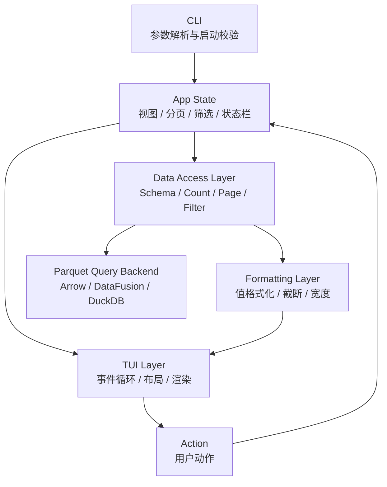
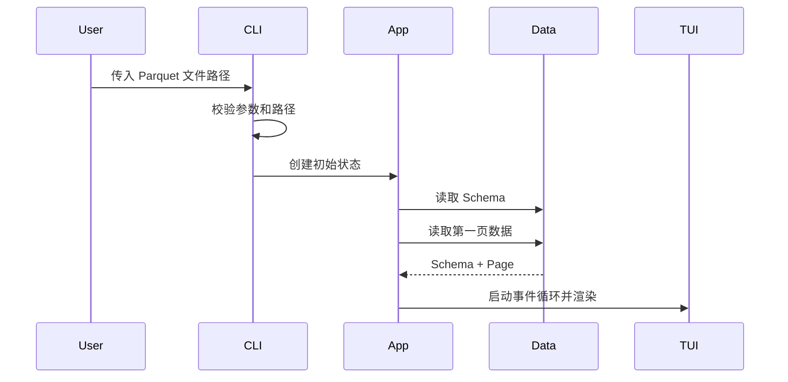
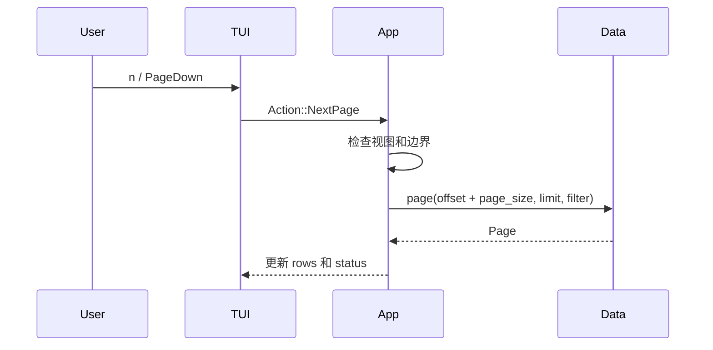
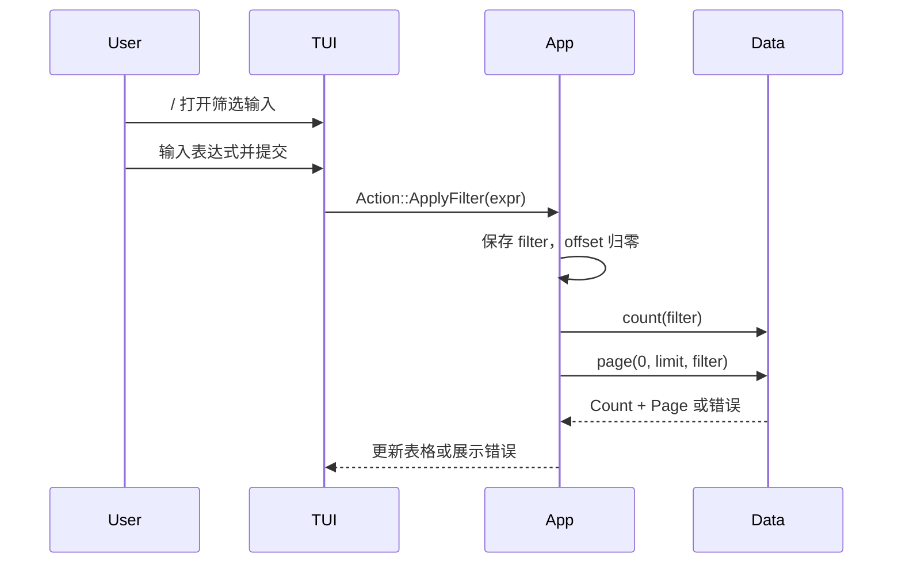
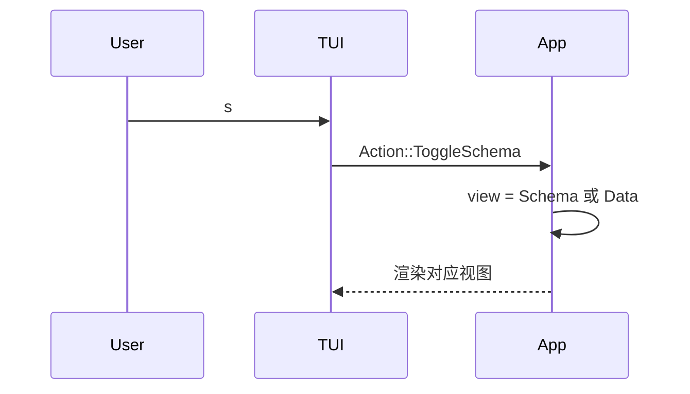

# Parquet TUI Viewer 设计方案

本文是 Rust 版 Parquet TUI Viewer 的方案设计文档。它描述第一阶段要交付的能力、架构边界、关键流程、技术取舍和待决策项。

当前文档描述的是拟议方案，不表示所有能力已经实现。已实现状态以代码和测试为准。

## 1. 背景

本项目目标是用 Rust 实现一个终端内运行的 Parquet 文件查看器。用户可以在不全量加载文件的前提下，按页浏览 Parquet 数据，查看 Schema，输入筛选条件，并通过 vim/k9s 风格快捷键完成主要操作。

根目录的 `parquet_tui.py` 是行为原型。Rust 实现应参考它的交互语义，包括分页、筛选、状态栏、Schema 视图和键盘操作；但不需要照搬 Python 原型的代码结构。

设计重点是先做一个可靠、只读、可扩展、对大文件友好的查看器，而不是一次性做成完整数据分析工具。

## 2. 目标与非目标

### 2.1 目标

- 单文件 Parquet 查看。
- 终端 TUI 交互。
- 默认分页读取，不全量加载数据行。
- 数据视图显示列名和当前页行数据。
- Schema 视图显示字段序号、字段名和类型信息。
- 支持键盘导航、水平滚动、翻页、筛选输入、筛选重置和退出。
- 状态栏显示文件、视图、行范围、页码、列数、筛选状态和错误提示。
- 将 TUI、应用状态、数据访问和值格式化分层，便于后续替换底层查询实现。

### 2.2 非目标

- 不编辑 Parquet 文件。
- 不修改源文件。
- 不默认导出当前页或筛选结果。
- 第一阶段不支持多文件 join、目录批量浏览、glob、远程对象存储路径。
- 第一阶段不提供完整 SQL 工作台体验。
- 第一阶段不承诺复杂筛选表达式是安全沙箱。
- 不为了显示总行数而默认扫描全部数据。

## 3. 用户体验需求

### 3.1 CLI 启动

- 用户通过命令行传入 Parquet 文件路径。
- 文件不存在、不可读或不是有效 Parquet 文件时，给出清晰错误。
- 初始化成功后进入 TUI 数据视图。

### 3.2 数据视图

- 默认显示数据表。
- 表头显示列名。
- 当前页显示固定数量的数据行。
- 单元格值转换为终端友好的文本。
- 超长值截断显示，并用省略标记表示仍有剩余内容。
- NULL 值使用稳定文本表示。
- 列表、Map、Struct、二进制等复杂值必须有可预测的降级显示策略。

### 3.3 Schema 视图

- 用户可以在数据视图和 Schema 视图之间切换。
- Schema 视图至少显示字段序号、字段名、逻辑类型或物理类型。
- Schema 视图不参与数据分页和筛选。

### 3.4 筛选

- 用户可以打开筛选输入框。
- 提交筛选后刷新结果集，并将分页位置重置到第一页。
- 用户可以重置筛选。
- 筛选失败不应导致程序崩溃；应保留当前界面并显示错误。
- 如果筛选表达式透传给底层查询引擎，UI 和文档必须明确说明表达式语义。

### 3.5 导航与快捷键

| 快捷键             | 行为                 |
|--------------------|----------------------|
| `j` / `↓`          | 下移一行             |
| `k` / `↑`          | 上移一行             |
| `h` / `←`          | 向左滚动             |
| `l` / `→`          | 向右滚动             |
| `H`                | 滚动到最左列         |
| `L`                | 滚动到最右列         |
| `J`                | 移动到当前页底部     |
| `K`                | 移动到当前页顶部     |
| `n` / `PageDown`   | 下一页               |
| `p` / `PageUp`     | 上一页               |
| `/`                | 打开筛选输入         |
| `r`                | 重置筛选             |
| `s`                | 切换 Schema 视图     |
| `Esc`              | 取消当前输入或弹层   |
| `q`                | 退出                 |

### 3.6 状态栏

状态栏应显示：

- 当前文件名。
- 当前视图模式。
- 当前行范围和总行数。
- 当前页码。
- 总列数。
- 当前筛选条件或筛选已启用标记。
- 最近一次错误或警告。

如果总行数计算代价过高，状态栏可以显示未知、计算中或统计失败状态。

## 4. 核心约束

- 数据读取默认按需分页。
- 不为了简化实现而默认全量加载 Parquet 文件。
- 大文件、宽表、复杂类型和异常元数据是一等场景。
- 所有常用操作必须能只靠键盘完成。
- 错误信息不能永久覆盖用户正在查看的数据。
- TUI 必须在退出或崩溃路径上尽量恢复终端状态。
- 不执行来自 Parquet 内容的任何代码。
- 不默认记录完整数据行到日志。
- 不默认写入用户文件。

## 5. 整体架构

系统分为 CLI、应用状态、TUI、数据访问和值格式化五个核心部分。



### 5.1 建议模块划分

```text
src/
  main.rs          # 入口；启动 TUI 并处理顶层错误
  cli.rs           # CLI 参数定义与启动校验
  app.rs           # 应用状态、动作分发、状态转移
  tui.rs           # 终端事件循环、布局和绘制
  data/
    mod.rs         # 数据访问 trait 与公共类型
    parquet.rs     # Parquet 数据源实现
    query.rs       # 筛选、分页、计数查询封装
  format.rs        # 单元格格式化、截断、宽字符处理
  error.rs         # 统一错误类型
```

模块结构可以按实现阶段调整，但层间职责不能混淆。

## 6. 模块职责

| 模块              | 职责                                      | 输入                         | 输出                         | 禁止事项                         |
|-------------------|-------------------------------------------|------------------------------|------------------------------|----------------------------------|
| CLI               | 解析参数、校验路径、启动应用              | 命令行参数                   | 启动配置或启动错误           | 不做数据查询                     |
| App State         | 保存视图、分页、筛选、选中项和状态消息    | 用户动作、数据命令结果       | 新状态、数据命令             | 不直接渲染终端                   |
| TUI Layer         | 处理键盘事件、布局、绘制                  | App State、终端事件          | 用户动作、终端画面           | 不拼接查询、不读取 Parquet       |
| Data Access Layer | 读取 Schema、统计行数、分页、应用筛选     | PageRequest、筛选表达式      | Page、Schema、Count          | 不泄漏具体引擎细节到 TUI        |
| Formatting Layer  | 将数据值转换为终端可显示文本              | 原始值、显示宽度策略         | CellView                     | 不执行查询、不修改应用状态       |
| Error Layer       | 统一错误类型和用户可见错误                | 内部错误                     | 结构化错误、展示消息         | 不吞掉关键上下文                 |

## 7. 应用状态与动作模型

TUI 事件不直接改数据源。所有输入先转换为领域动作，再由状态机处理。

```text
KeyEvent -> Action -> AppState transition -> optional DataCommand -> render
```

### 7.1 核心状态

```rust
pub struct AppState {
    pub file_path: PathBuf,
    pub view: ViewMode,
    pub offset: usize,
    pub page_size: usize,
    pub total_rows: CountState,
    pub schema: Vec<ColumnInfo>,
    pub filter: Option<String>,
    pub rows: Vec<RowView>,
    pub selected_row: usize,
    pub scroll_x: u16,
    pub status: StatusLine,
}

pub enum ViewMode {
    Data,
    Schema,
}

pub enum CountState {
    Unknown,
    Loading,
    Known(u64),
    Failed(String),
}
```

### 7.2 典型动作

| Action              | 前置条件                 | 状态变化                         | 数据命令                  |
|---------------------|--------------------------|----------------------------------|---------------------------|
| `NextPage`          | 数据视图，未到末页       | `offset += page_size`            | 加载新页                  |
| `PrevPage`          | 数据视图，`offset > 0`   | `offset -= page_size`            | 加载新页                  |
| `ToggleSchema`      | 任意视图                 | 切换 `view`                      | 无或加载 Schema           |
| `ApplyFilter(expr)` | 数据视图                 | 保存筛选，`offset = 0`           | count + 加载第一页        |
| `ResetFilter`       | 数据视图                 | 清空筛选，`offset = 0`           | count + 加载第一页        |
| `CursorDown`        | 当前页有下一行           | `selected_row += 1`              | 无                        |
| `ScrollRight`       | 有水平可滚动区域         | `scroll_x` 增加                  | 无                        |
| `Quit`              | 任意状态                 | 退出                             | 无                        |

## 8. 关键流程

### 8.1 启动流程



### 8.2 翻页流程



### 8.3 筛选流程



### 8.4 Schema 切换流程



## 9. 数据访问设计

TUI 不应依赖 Arrow、DataFusion、DuckDB 或其他具体引擎。数据访问层通过 trait 隔离底层实现。

```rust
pub trait ParquetDataSource {
    fn schema(&mut self) -> Result<Vec<ColumnInfo>>;
    fn count(&mut self, filter: Option<&str>) -> Result<u64>;
    fn page(&mut self, request: PageRequest<'_>) -> Result<Page>;
}

pub struct PageRequest<'a> {
    pub offset: usize,
    pub limit: usize,
    pub filter: Option<&'a str>,
}
```

### 9.1 分页

- `offset` 表示筛选后结果集中的逻辑行偏移。
- `limit` 表示当前页最多显示的行数。
- 数据访问层负责将逻辑分页映射到底层批读取、SQL 查询或执行计划。
- 如果底层无法高效随机跳页，可以先实现顺序分页，再在文档中标注限制。

### 9.2 Count

- `count(filter)` 用于状态栏总行数和页码。
- Count 失败不应阻塞用户查看第一页数据。
- Count 成本高时允许引入懒统计、缓存、后台任务或未知状态。

### 9.3 筛选表达式

第一阶段可以选择透传底层查询引擎表达式，但必须满足：

- UI 明确提示表达式语法来自底层引擎。
- 错误可恢复。
- 不宣称筛选表达式是安全沙箱。
- 后续可替换为受限 DSL 或表达式构造器。

## 10. 技术选型

### 10.1 TUI

推荐使用 `ratatui` + `crossterm`。

理由：

- Rust 生态成熟。
- 支持可控事件循环、布局和表格绘制。
- 与自定义状态机配合清晰。
- 跨平台终端支持较好。

### 10.2 Parquet 读取路线

| 路线                   | 优点                                             | 代价                                             | 适用判断                         |
|------------------------|--------------------------------------------------|--------------------------------------------------|----------------------------------|
| Arrow / parquet crate  | Rust 原生，依赖边界清晰，类型和批读取可控       | 筛选和精确分页需要更多自研或组合 DataFusion     | 长期可控、偏纯 Rust              |
| DataFusion             | SQL/filter 能力完整，执行计划和 Parquet 扫描成熟 | 依赖较重，异步模型需要封装                       | 想要查询能力且接受较重依赖       |
| DuckDB 绑定            | 最接近 Python 原型，筛选、count、分页实现简单   | 原生库分发和跨平台构建更复杂                     | 优先快速复刻原型                 |

阶段性建议：

- 如果目标是尽快复刻 Python 原型，优先评估 DuckDB 绑定。
- 如果目标是长期维护和纯 Rust 分发，优先评估 Arrow + DataFusion。
- 无论选择哪条路线，都必须封装在 Data Access Layer 内，避免影响 TUI 和 App State。

## 11. 显示、错误与边界场景

### 11.1 值显示

| 值类型       | 显示策略                                   |
|--------------|--------------------------------------------|
| NULL         | 显示固定文本，例如 `NULL`                  |
| 长字符串     | 按显示宽度截断，追加省略标记               |
| 宽字符       | 按终端显示宽度计算，不按字节数截断         |
| 二进制       | 显示十六进制摘要或 `<binary N bytes>`      |
| List / Map   | 显示紧凑摘要，必要时截断                   |
| Struct       | 显示紧凑结构摘要，必要时截断               |
| 时间/日期    | 使用稳定、可读的文本格式                   |

后续可以增加单元格详情弹窗，用于查看完整值。

### 11.2 错误分类

| 错误类型   | 示例                             | 处理方式                                     |
|------------|----------------------------------|----------------------------------------------|
| 启动错误   | 参数缺失、路径不存在、不可读     | 退出并返回非零状态码                         |
| 初始化错误 | Schema 或 metadata 读取失败      | 明确提示；可选择不进入 TUI                   |
| 查询错误   | 筛选语法错误、count 失败         | 保留 TUI，上报状态栏，不清空已有上下文       |
| 渲染错误   | 终端尺寸过小、绘制失败           | 尽量降级；无法恢复时退出并恢复终端状态       |

### 11.3 边界场景

- 空文件或空结果集。
- 列数非常多的宽表。
- 单元格值极长。
- 嵌套结构复杂。
- 筛选表达式非法。
- Count 慢或失败。
- 终端尺寸很小。
- 用户在筛选输入中按 `Esc` 取消。

## 12. 测试策略

### 12.1 单元测试

- 分页边界：第一页、最后一页、空结果、上一页不小于 0。
- 视图切换：Schema/Data 互切不破坏筛选条件。
- 筛选提交：offset 重置，状态栏包含筛选状态。
- 状态转移：每个 Action 的前置条件和状态变化。
- 值格式化：NULL、长字符串、宽字符、二进制、嵌套值。
- 状态栏：有无总数、有无筛选、有无错误。

### 12.2 集成测试

- 用小型临时 Parquet 文件验证 Schema、count、page。
- 用空 Parquet 文件验证空数据展示。
- 用多列宽表验证水平滚动状态。
- 用非法筛选表达式验证错误可恢复。
- 用复杂类型字段验证显示降级策略。

### 12.3 手动验收

- 打开含 100 行以上的文件，验证翻页。
- 打开宽表，验证水平滚动和最左/最右跳转。
- 输入有效筛选，验证总数和页码刷新。
- 输入无效筛选，验证程序不崩溃。
- 切换 Schema 视图，再切回数据视图，验证状态保留。
- 退出后终端状态恢复正常。

## 13. 里程碑

### 13.1 M1：最小可启动查看器

交付能力：

- CLI 接收文件路径。
- 读取 Schema。
- 显示第一页数据。
- 支持退出。

验收标准：

- 有效 Parquet 文件能进入 TUI。
- 无效路径能给出明确错误。
- 退出后终端恢复正常。

### 13.2 M2：导航与分页

交付能力：

- 行导航。
- 水平滚动。
- 上一页和下一页。
- 状态栏显示行范围、页码和列数。

验收标准：

- 翻页不改变筛选条件。
- 上一页不会越过第一页。
- 最后一页不会越界。

### 13.3 M3：Schema 与筛选

交付能力：

- Schema 视图。
- 筛选输入。
- 筛选重置。
- 查询错误展示。

验收标准：

- 切换 Schema 不破坏数据视图状态。
- 提交筛选后 offset 归零。
- 非法筛选表达式不导致崩溃。

### 13.4 M4：健壮性与体验

交付能力：

- 类型显示策略完善。
- 宽字符和截断处理。
- 更完整测试。
- 终端恢复和错误路径打磨。

验收标准：

- 复杂类型和异常值不会破坏表格布局。
- 空数据和错误路径有稳定展示。
- 核心状态转移有测试覆盖。

## 14. 风险与待决策项

### 14.1 风险与缓解

| 风险                         | 影响                         | 缓解策略                                      |
|------------------------------|------------------------------|-----------------------------------------------|
| Count 代价过高               | 打开或筛选后卡顿             | 懒统计、缓存、后台任务、允许显示未知          |
| 查询引擎依赖过重             | 构建慢、分发复杂             | 用 Data Access trait 隔离，先做小样例评估     |
| 复杂类型显示不可控           | 表格布局破坏                 | 统一 Formatting Layer，先摘要再详情           |
| 宽字符截断错误               | UI 错位                      | 使用显示宽度计算，不按字节截断                |
| 筛选表达式语义不清           | 用户误解能力或安全边界       | UI 和文档明确表达式来源与限制                 |
| 查询阻塞 UI                  | TUI 无响应                   | 后续引入异步查询、取消任务或进度状态          |
| 终端恢复失败                 | 用户 shell 状态异常          | 统一终端生命周期管理，错误路径也执行恢复      |

### 14.2 待决策项

- 第一阶段数据访问路线选择：Arrow 原生、DataFusion，还是 DuckDB 绑定。
- 是否默认计算精确总行数。
- 筛选表达式是直接暴露查询引擎语法，还是设计受限 DSL。
- 是否需要异步查询与取消。
- 是否支持列选择、排序、单元格详情弹窗、导出当前页。
- 是否需要为大型样例建立单独的性能测试集。
