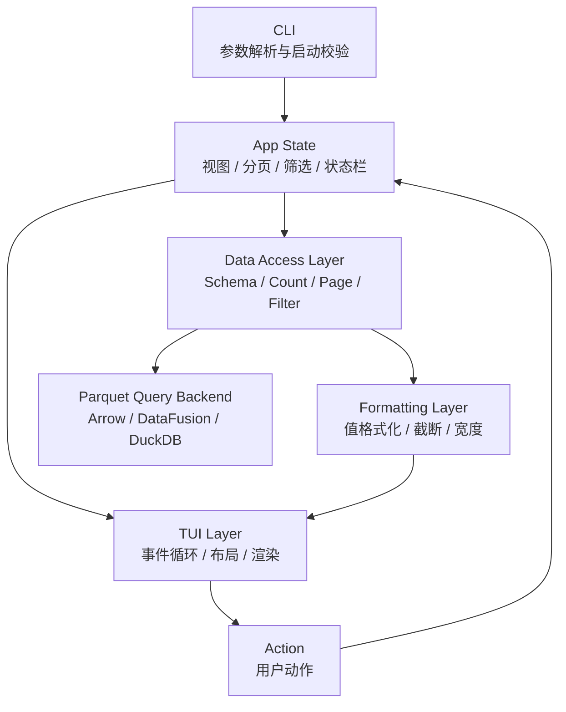

# 00. 总览与架构边界

## 背景

本项目目标是用 Rust 实现一个终端内运行的 Parquet 文件查看器。用户可以在不全量加载文件的前提下，按页浏览 Parquet 数据，查看 Schema，输入筛选条件，并通过 vim/k9s 风格快捷键完成主要操作。

根目录的 `parquet_tui.py` 是行为原型。Rust 实现应参考它的交互语义，包括分页、筛选、状态栏、Schema 视图和键盘操作；但不需要照搬 Python 原型的代码结构。

设计重点是先做一个可靠、只读、可扩展、对大文件友好的查看器，而不是一次性做成完整数据分析工具。

## 整体架构

系统分为 CLI、应用状态、TUI、数据访问和值格式化五个核心部分。



## 建议模块划分

```text
src/
  main.rs          # 入口；启动 TUI 并处理顶层错误
  cli.rs           # CLI 参数定义与启动校验
  app.rs           # 应用状态、动作分发、状态转移
  tui.rs           # 终端事件循环、布局和绘制
  data/
    mod.rs         # 数据访问 trait 与公共类型
    parquet.rs     # Parquet 数据源实现
    query.rs       # 筛选、分页、计数查询封装
  format.rs        # 单元格格式化、截断、宽字符处理
  error.rs         # 统一错误类型
```

模块结构可以按实现阶段调整，但层间职责不能混淆。

## 模块职责

| 模块 | 职责 | 输入 | 输出 | 禁止事项 |
|------|------|------|------|----------|
| CLI | 解析参数、校验路径、启动应用 | 命令行参数 | 启动配置或启动错误 | 不做数据查询 |
| App State | 保存视图、分页、筛选、选中项和状态消息 | 用户动作、数据命令结果 | 新状态、数据命令 | 不直接渲染终端 |
| TUI Layer | 处理键盘事件、布局、绘制 | App State、终端事件 | 用户动作、终端画面 | 不拼接查询、不读取 Parquet |
| Data Access Layer | 读取 Schema、统计行数、分页、应用筛选 | PageRequest、筛选表达式 | Page、Schema、Count | 不泄漏具体引擎细节到 TUI |
| Formatting Layer | 将数据值转换为终端可显示文本 | 原始值、显示宽度策略 | CellView | 不执行查询、不修改应用状态 |
| Error Layer | 统一错误类型和用户可见错误 | 内部错误 | 结构化错误、展示消息 | 不吞掉关键上下文 |

## 核心约束

- 数据读取默认按需分页。
- 不为了简化实现而默认全量加载 Parquet 文件。
- 大文件、宽表、复杂类型和异常元数据是一等场景。
- 所有常用操作必须能只靠键盘完成。
- 错误信息不能永久覆盖用户正在查看的数据。
- TUI 必须在退出或崩溃路径上尽量恢复终端状态。
- 不执行来自 Parquet 内容的任何代码。
- 不默认记录完整数据行到日志。
- 不默认写入用户文件。

## 完成本文件后的下一步

继续实现 [`01-scope-and-requirements.md`](./01-scope-and-requirements.md)，先锁定第一阶段范围，避免实现中途不断扩大目标。
