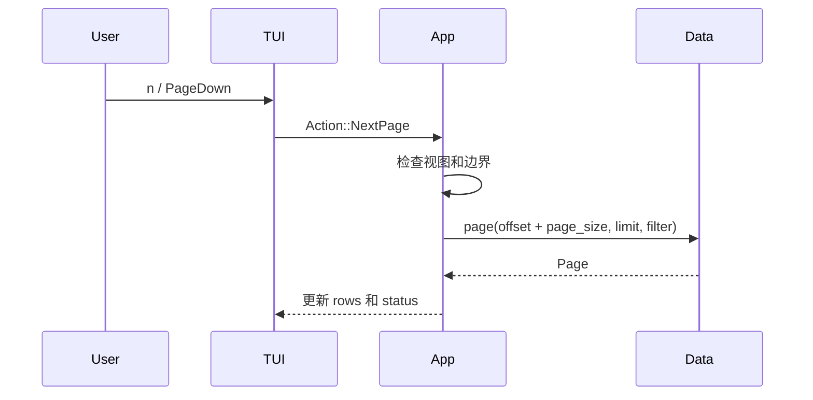
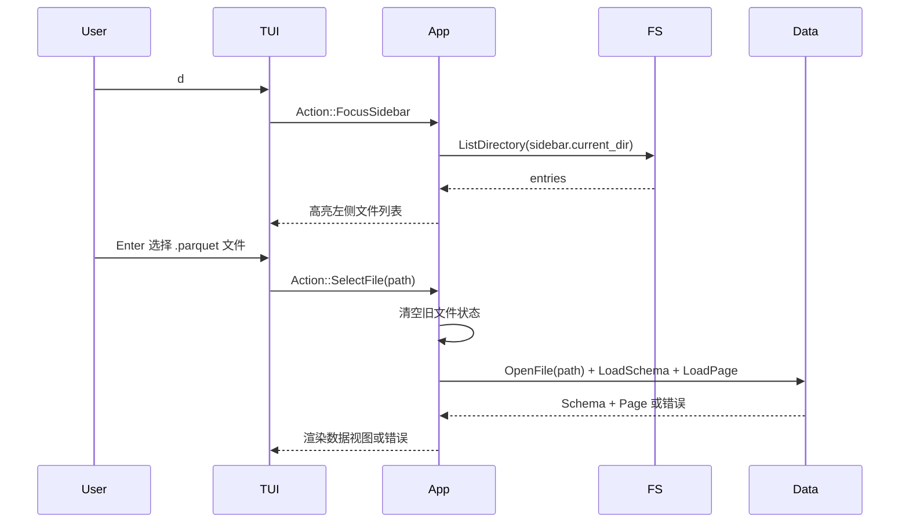

# 06. TUI 布局与导航

## 实现目标

本阶段实现终端事件循环、LazyVim 风格布局、顶部 tab 栏、贯穿全高的左侧文件列表侧边栏、表格渲染、状态栏、基础导航、筛选弹窗、帮助弹窗和文件选择入口。此阶段可以先接入假数据或前面实现的数据访问层。

## 技术选型

### TUI 框架

| 候选库 | 优点 | 代价 | 结论 |
|--------|------|------|------|
| `ratatui` | 轻量、低层可控；适合表格、状态栏、输入框和自定义事件循环；可搭配多个 backend | 需要自己维护状态机和事件分发 | **推荐**。本项目需要清晰分层和可测试状态机 |
| `cursive` | 更高层，内置较多控件 | 框架控制权更强，和自定义 App State/Action 模型不够贴合 | 暂不选 |
| 直接使用 `crossterm` | 控制力最高，依赖少 | 表格、布局、样式都要自研，开发成本高 | 暂不选，除非后续极度追求轻量 |

### 终端 backend

| 候选库 | 优点 | 代价 | 结论 |
|--------|------|------|------|
| `crossterm` | 跨平台；键盘事件、raw mode、alternate screen 支持成熟；与 `ratatui` 常见组合 | 仍需谨慎处理终端恢复 | **推荐** |
| `termion` | Unix 终端生态常见 | 跨平台能力不如 `crossterm` | 不作为默认选择 |
| `termwiz` | 能力强，适合复杂终端场景 | 对本项目第一阶段偏重 | 暂不选 |

第一阶段默认组合：`ratatui` + `crossterm`。TUI 层只做事件、布局和渲染，不做数据查询。

## 布局

```text
┌──────────────┬─────────────────────────┐
│ file sidebar │ tab bar                 │
│ root cwd     ├─────────────────────────┤
│              │ table header / empty    │
│              │ row 1                   │
│              │ row 2                   │
│              │ ...                     │
│              ├─────────────────────────┤
│              │ status bar              │
└──────────────┴─────────────────────────┘
```

布局原则：左侧文件列表从屏幕顶部占到底部。右侧区域内部只常驻 tab 栏、数据表和状态栏。筛选输入与帮助信息都使用覆盖式弹窗，不占用常规布局空间。不要在底部常驻 key hints。


## 筛选弹窗

默认不显示筛选输入区域。用户按 `/` 时打开筛选弹窗。

弹窗规则：

- 覆盖在右侧内容区之上，不改变左侧侧边栏高度。
- 可以居中，也可以靠近顶部，但不作为常驻布局行。
- 显示当前筛选条件，允许编辑。
- `Enter` 提交筛选，关闭弹窗并刷新数据。
- `Esc` 取消输入，关闭弹窗并保留原筛选条件。
- 筛选错误显示在状态栏或错误消息区域，不破坏当前数据视图。
- 筛选成功后，下方 status 栏显示当前筛选条件。

## 帮助弹窗

默认不展示常驻 key hints。用户按 `h` 时打开帮助弹窗。

弹窗参考 btop 的帮助界面：

- 居中覆盖在当前界面之上。
- 使用边框和标题，例如 `Help` 或 `Keys`。
- 按分组展示快捷键：全局、文件侧边栏、表格、筛选、Schema、tab。
- 背景界面不改变状态。
- `Esc` 或再次按 `h` 关闭弹窗。
- 弹窗不占用常规布局空间，不影响左侧侧边栏高度。

## 顶部 Tab 栏

顶部 tab 栏参考 Neovim tabline，用于展示当前打开的 Parquet 文件。

第一阶段显示规则：

- 固定占用屏幕最上方一行。
- 未打开文件时显示 `[No file]` 或等价提示。
- 打开文件后显示当前文件 basename。
- 当前 tab 高亮。
- 文件名过长时截断，不能挤占整个界面。
- 第一阶段不要求鼠标点击、关闭按钮或多 tab 切换。

后续多 tab 规则：

- 每个 tab 对应一个 Parquet 文件。
- tab 标题默认使用 basename，重名时可显示父目录片段区分。
- 切换 tab 时恢复该文件自己的 offset、filter、selected row 和 scroll_x。
- 关闭最后一个 tab 后回到 Empty 视图。

## TUI 层职责

- 进入和退出终端模式。
- 读取键盘事件。
- 将键盘事件转换为 `Action`。
- 根据 `AppState` 绘制左侧全高文件列表、顶部 tab 栏、表格、状态栏、筛选弹窗、帮助弹窗和空状态提示。
- 调用状态机处理动作。
- 根据状态机返回的数据命令协调数据访问。

TUI 层不得：

- 直接拼接查询。
- 直接读取 Parquet。
- 直接格式化复杂数据值。
- 持有底层查询引擎类型。

## 导航行为

| 快捷键 | 行为 |
|--------|------|
| `j` / `↓` | 下移一行 |
| `k` / `↑` | 上移一行 |
| `h` | 打开帮助弹窗 |
| `←` | 向左滚动 |
| `l` / `→` | 向右滚动 |
| `H` | 滚动到最左列 |
| `L` | 滚动到最右列 |
| `J` | 移动到当前页底部 |
| `K` | 移动到当前页顶部 |
| `n` / `PageDown` | 下一页 |
| `p` / `PageUp` | 上一页 |
| `s` | 切换 Schema 视图 |
| `d` | 聚焦/切换左侧文件列表 |
| `q` | 退出 |


## 左侧文件列表侧边栏

左侧侧边栏用于浏览本地文件并选择 Parquet 文件。根目录是程序启动时的当前工作目录。

第一阶段侧边栏要求：

- 固定显示在屏幕最左侧，并从顶部贯穿到底部。
- 根目录为程序运行目录，记为 `root_dir`。
- 可以进入 `root_dir` 下的子目录。
- 返回上级目录时不能越过 `root_dir`。
- 显示目录项和 `.parquet` 文件；其他文件可以隐藏或弱化显示。
- `d` 用于聚焦或切换到侧边栏。
- 侧边栏高度不受 tab 栏、状态栏、筛选弹窗和帮助弹窗影响。
- 侧边栏聚焦时，`j/k` 或方向键移动选中项。
- 侧边栏聚焦时，`Enter` 打开目录或选择 `.parquet` 文件。
- `Esc` 让焦点回到主区域。
- 选择文件后触发 `SelectFile(path)`，由 App State 创建或替换当前 tab、清空旧状态，再由 Data Access 加载 Schema 和第一页。

第一阶段不要求：

- 模糊搜索。
- 多选。
- 远程路径。
- 文件预览。
- 批量目录管理。
- 鼠标操作。

## 翻页流程




## 侧边栏文件选择流程



## 状态栏

状态栏由 `AppState` 派生，至少显示：

- 状态栏显示视图、行范围和错误；文件名主要显示在顶部 tab 栏。
- 未打开文件时，tab 栏显示 `[No file]`，状态栏显示“按 `d` 聚焦文件列表”。
- 状态栏可显示侧边栏当前目录或选中文件。
- 如果存在筛选条件，状态栏必须显示 `filter: ...`；过长时截断。
- 当前视图。
- 行范围和总数。
- 页码。
- 列数。
- 筛选状态。
- 最近错误。

## 手动验收

- 不带文件启动后能看到贯穿全高的左侧文件列表、右侧顶部 `[No file]` tab、空状态、状态栏和 `d` 聚焦提示。
- 左侧文件列表根目录是程序运行目录。
- 按 `d` 能聚焦左侧文件列表。
- 在左侧文件列表中选择 `.parquet` 文件后能进入数据视图，顶部 tab 显示该文件名。
- `Esc` 能把焦点从侧边栏还给主区域。
- 启动后能看到表格区域和状态栏。
- `j/k` 或方向键能移动行选择。
- `/` 能打开筛选弹窗，`Esc` 能取消，`Enter` 能提交。
- 提交筛选后 status 栏显示当前筛选条件，重置后消失。
- `h` 能打开帮助弹窗，`Esc` 或再次按 `h` 能关闭。
- `←/l/→` 能水平滚动，其中 `h` 不再用于左滚。
- `n/p` 能翻页。
- `q` 能退出并恢复终端状态。

## 下一步

继续实现 [`07-filtering-and-schema-view.md`](./07-filtering-and-schema-view.md)。
