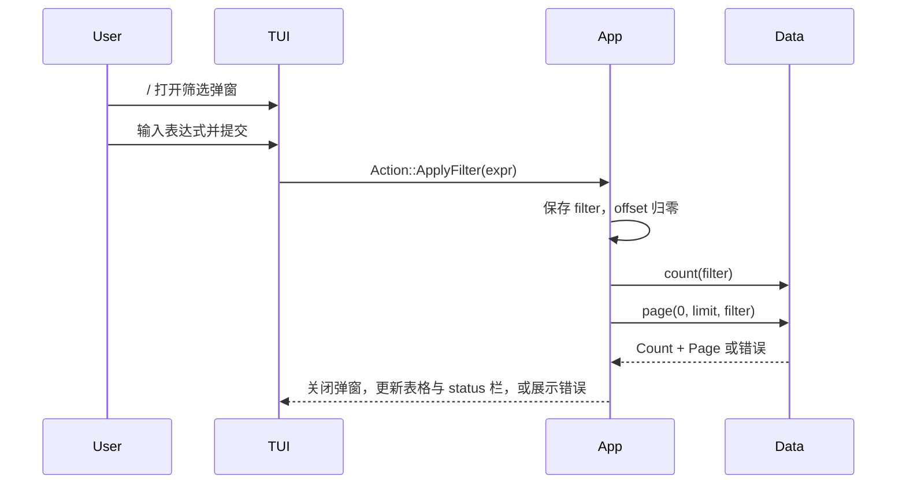
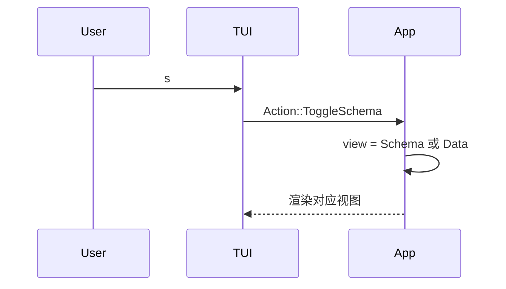

# 07. 筛选与 Schema 视图

## 实现目标

本阶段实现筛选输入、筛选重置、筛选错误恢复和 Schema 视图。完成后，核心交互应接近 Python 原型。

## 筛选弹窗

- `/` 打开筛选输入弹窗。
- `Enter` 提交筛选并关闭弹窗。
- `Esc` 取消筛选输入并关闭弹窗。
- 筛选弹窗不占用常规布局空间，不挤压左侧侧边栏或数据表。
- `r` 重置筛选。
- 提交新筛选后 `offset = 0`。
- 筛选成功后，下方 status 栏显示当前筛选条件。
- 筛选失败时保留当前界面，并显示错误。

## 筛选流程

## 筛选表达式边界

第一阶段可以选择透传底层查询引擎表达式，但必须满足：

- UI 明确提示表达式语法来自底层引擎。
- 错误可恢复。
- 不宣称筛选表达式是安全沙箱。
- 后续可替换为受限 DSL 或表达式构造器。

## Schema 视图

Schema 视图至少显示：

- 字段序号。
- 字段名。
- 逻辑类型或物理类型。

Schema 视图不参与数据分页和筛选。

## Schema 切换流程

## 状态保持

- 从数据视图切到 Schema 视图时，保留当前筛选条件和分页位置。
- 从 Schema 视图切回数据视图时，恢复原数据视图状态。
- 在 Schema 视图中，翻页动作可以无效或只用于 Schema 表格滚动；第一阶段建议无效。

## 测试重点

- 提交筛选后 offset 归零。
- 重置筛选后 offset 归零。
- 非法筛选表达式不导致崩溃。
- Schema/Data 互切不破坏筛选条件。
- Schema 视图不触发数据页查询。

## 验收标准

- `/` 能打开筛选输入弹窗。
- `Esc` 能取消筛选输入并关闭弹窗。
- 有效筛选能刷新结果，并在 status 栏显示当前筛选条件。
- 无效筛选能展示错误并保留上下文。
- 重置筛选后 status 栏移除筛选条件。
- `s` 能在数据视图和 Schema 视图之间切换。

## 下一步

继续实现 [`08-testing-strategy.md`](./08-testing-strategy.md)。
